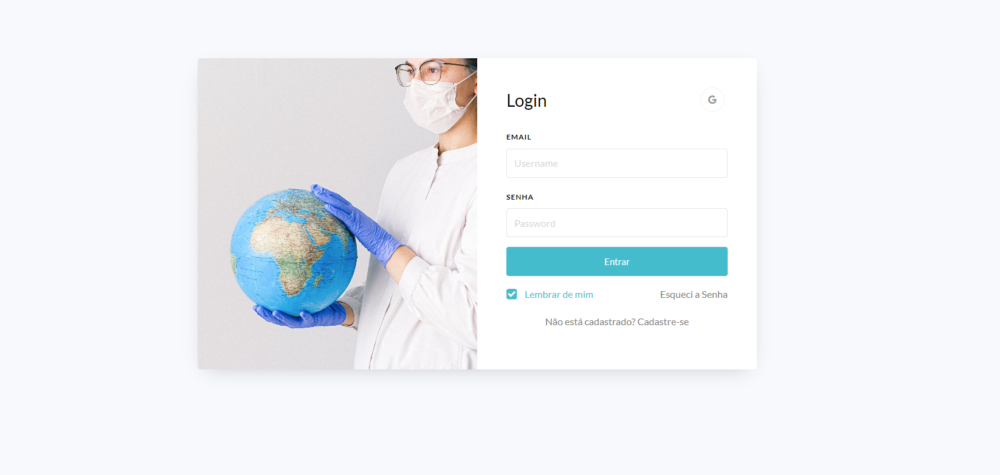

# Trabalho Programação para a Internet - Gabriel Braga

> Site Criado para Simular um Dashboard de um Hospital, com o objetivo da realização do Trabalho De Programação para a Internet 2.

### Ajustes e melhorias

O projeto ainda está em desenvolvimento e as próximas atualizações serão voltadas nas seguintes tarefas:

- [X] Aplicar JS
- [X] Melhorar CSS
- [X] Melhorar HTML

## 💻 Link do Site

[--LINK--](https://gabriell-braga.github.io/MedNet/) 

🤝 Criadores

Criadores deste projeto:

<table>
  <tr>
    <td align="center">
      <a href="https://github.com/Gabriell-Braga">
         
        
          <b>Gabriel Braga</b>
        
      </a>
    </td>
     <td align="center">
      <a href="https://github.com/guigutox">
         
        
          <b>Guilherme Fernandes</b>
        
      </a>
    </td>
    <td align="center">
      <a href="https://github.com/Anton0910">
         
        
          <b>Antonio Emilio</b>
        
      </a>
    </td>
    <td align="center">
      <a href="https://github.com/2xTi">
         
        
          <b>Tiago Reis</b>
        
      </a>
    </td>
  </tr>
</table>

[⬆ Voltar ao topo](#nome-do-projeto) 
